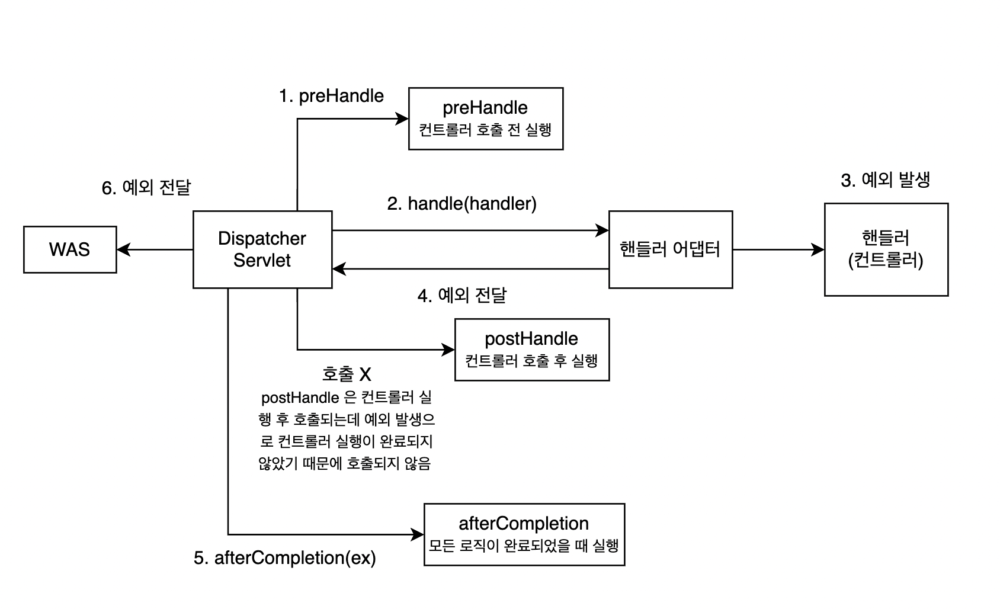
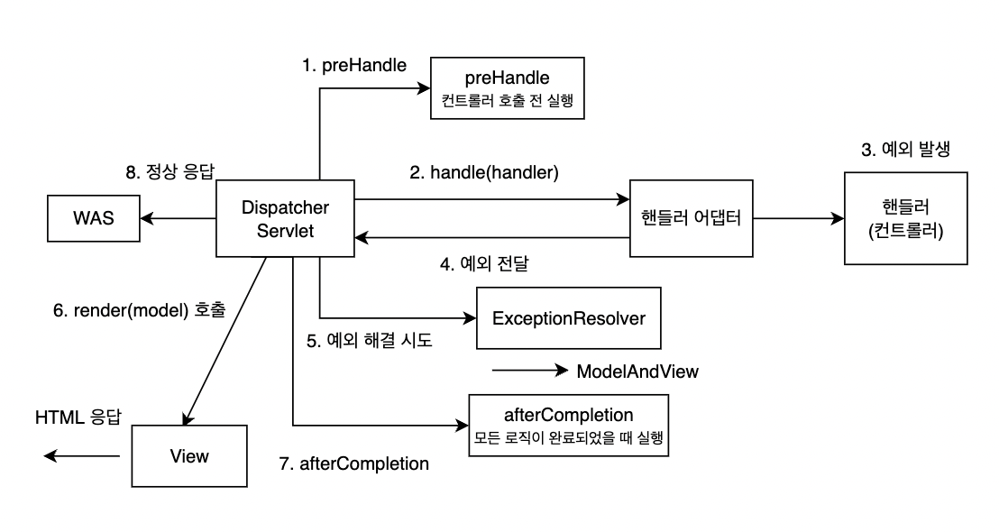

# 03 HandlerExceptionResolver 시작

예외가 발생해서 서블릿을 넘어 WAS 까지 예외가 전달되면 HTTP 상태코드는 500<br>
👉 서버 내부적으로 오류가 발생한 경우기 때문에 

하지만, 발생하는 예외에 따라서 400, 404 등등 다른 상태코드나 오류 페이지, 형식 등을 API 마다 다르게 하고 싶은 경우엔 어떻게 처리해야할까 ?

### 상태 코드 변환 
**<상황>**<br>
IllegalArgumentException 을 처리하지 못해서 컨트롤러 밖으로 넘어가는 일이 발생<br>
잘못된 파라미터를 전달한 경우일 수 있으므로 HTTP 상태코드를 400 으로 처리하고 싶을 때 

1. ApiExceptionController.java 에 아래 코드 추가 
```java
if (id.equals("bad")) {
    throw new IllegalArgumentException("잘못된 입력 값");
}
```

2. 500 으로 response 리턴됨. 
```json
{
    "timestamp": "2022-06-05T08:12:42.822+00:00",
    "status": 500,
    "error": "Internal Server Error",
    "path": "/api/members/bad"
}
```

### HandlerExceptionResolver
스프링 MVC 는 HandlerExceptionResolver 를 통해 스프링 컨트롤러 밖으로 예외가 던져진경우 예외를 해결하고, 동작을 새로 정의할 수 있는 방법을 제공한다

인터셉터 메소드<br>
① preHandle : 컨트롤러 실행 전<br>
② postHandle : 컨트롤러 실행 후<br>
③ afterCompletion : 모든 실행이 완료 된 후

HandlerExceptionResolver 적용하기 전 ⬇️



HandlerExceptionResolver 적용 후 ⬇️

- ExceptionResolver 를 사용해도 postHandle() 은 실행되지 않는다. (예외가 발생하면 아예 호출 X)
- ExceptionResolver 에서 예외를 해결하기 위해서 시도하고, 해결한 경우 정상적으로 응답을 리턴한다.

### 코드에 적용하기

HandlerExceptionResolver.java
```java
public interface HandlerExceptionResolver {
    ModelAndView resolveException(HttpServletRequest request, 
                                  HttpServletResponse response, 
                                  @Nullable Object handler, 
                                  Exception ex);
}
```

MyHandlerExceptionResolver.java 코드 추가
```java
@Slf4j
public class MyHandlerExceptionResolver implements HandlerExceptionResolver {

    @Override
    public ModelAndView resolveException(HttpServletRequest request, HttpServletResponse response, Object handler, Exception ex) {

        // 예외가 넘어오면 정상적인 ModelAndView 로 반환
        try {
            if (ex instanceof IllegalAccessException) {
                log.info("IllegalArgumentException resolver to 400");
                // IllegalAccessException error 를 400 에러로 리턴
                response.sendError(HttpServletResponse.SC_BAD_REQUEST, ex.getMessage());
                // 빈값으로 넘기면 WAS 까지 정상적인 흐름으로 리턴
                return new ModelAndView();
            }
        } catch (IOException e) {
            log.error("resolver ex", e);
        }

        // null 로 리턴하면 예외가 그냥 날라감.
        return null;
    }

}
```

코드 추가 후 WebConfig 에 exceptionResolver 등록 

```java
@Override
public void extendHandlerExceptionResolvers(List<HandlerExceptionResolver> resolvers) {
    // exceptionResolver 등록
    resolvers.add(new MyHandlerExceptionResolver());
}
```

**반환 값에 따른 동작 방식**<br>
1. 빈 ModelAndView<br>
: 뷰를 렌더링하지 않고, 정상 흐름으로 서블릿이 리턴된다. 

2. ModelAndView 지정 <br>
: 뷰를 렌더링한다. 

3. null <br>
: 다음 ExceptionResolver 를 찾아서 실행한다. 만약 처리할 수 있는 ExceptionResolver 가 없는 경우 예외처리가 되지 않고, 기존에 발생한 예외를 서블릿 밖으로 던진다.

**ExceptionResolver 활용**
1. 예외 상태 코드 변환
<br>: 예외를 response.sendError 호출로 변경해서 서블릿에서 상태 코드에 따른 오류를 처리하도록 위임
<br>: WAS 는 서블릿 오류 페이지를 찾아서 내부 호출

2. 뷰 템플릿 처리
<br>: ModelAndView 에 값을 채워서 예외에 따른 새로운 오류 화면 뷰 렌더링 해서 고객에게 제공 

3. API 응답 처리
<br>: response.getWriter().printf("fdfsdfsdfsd"); 처럼 HTTP 응답 바디에 직접 데이터를 넣어주는 것도 가능하다.
<br>: 여기에 JSON 을 넣어주면 JSON 으로 응답 처리 가능

**WenConfig 등록**<br>
configureHandlerExceptionResolvers() 를 사용하면 스프링이 기본으로 등록하는 ExcpetionResolver 제거 되기 때문에 extendHandlerExceptionResolvers 로 등록해줘야 한다  